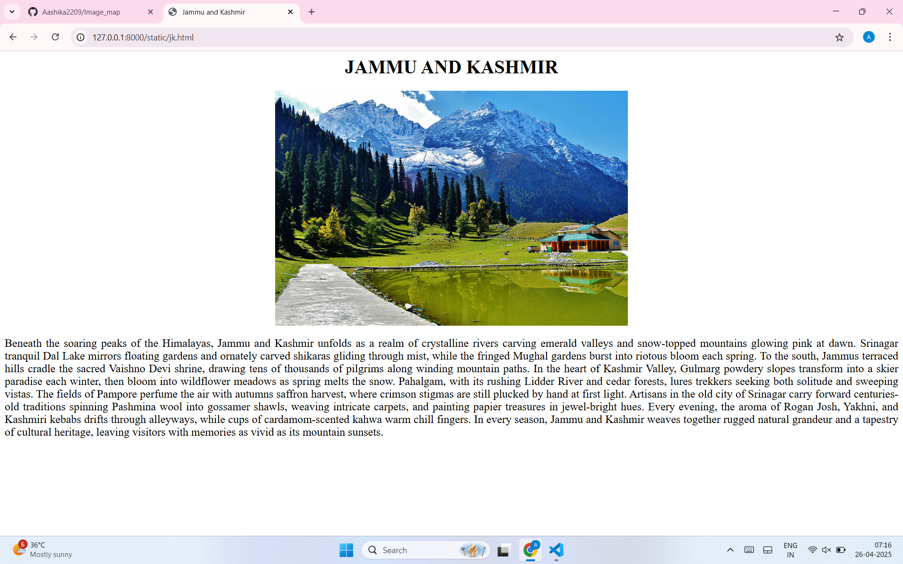

# Ex04 Places Around Me
# Date:26-04-2025
# AIM
To develop a website to display details about the places around my house.

# DESIGN STEPS
## STEP 1
Create a Django admin interface.

## STEP 2
Download your city map from Google.

## STEP 3
Using <map> tag name the map.

## STEP 4
Create clickable regions in the image using <area> tag.

## STEP 5
Write HTML programs for all the regions identified.

## STEP 6
Execute the programs and publish them.

# CODE
```
map.html
<html>
    <head>
        <title>My country</title>
    </head>
    <body>
        <h1 align="center" style="color: rgb(124, 27, 27);">India</h1>
        <h3 align="center" style="color: rgb(0, 0, 0)"> AASHIKA JAIN .G (212224110001) </h3>
        
        <center>
            
            <map name="mycountry"><area target="" alt="Jammu &amp; Kashmir" title="Jammu &amp; Kashmir" href="jk.html" coords="189,183,149,156,141,115,159,95,119,62,154,44,189,34,246,84,312,73,318,81,309,110,296,130,283,144,300,165,285,180,269,175,225,154,198,182" shape="poly">
                <area target="" alt="TamilNadu" title="TamilNadu" href="tn.html" coords="238,845,241,812,237,791,225,770,217,754,251,745,249,729,256,723,270,732,315,704,318,723,313,733,309,754,306,790,256,850" shape="poly">
                <area target="" alt="Madhya Pradesh" title="Madhya Pradesh" href="map.html" coords="328,491,229,491,220,505,161,479,166,450,180,425,185,396,199,425,231,415,231,395,242,386,220,375,265,344,287,358,266,388,271,411,282,410,275,383,303,393,317,383,323,394,356,394,374,405,377,428,353,431,364,445,351,463,336,469" shape="poly">
                <area target="" alt="Telangana" title="Telangana" href="tel.html" coords="245,640,248,579,269,536,308,547,339,594,336,610,301,622,289,638,259,644" shape="poly">
                <area target="" alt="Assam" title="Assam" href="as.html" coords="558,358,562,345,660,339,677,319,714,312,715,328,663,369,640,411,623,414,632,379,624,366,599,372,564,373" shape="poly">
            </map>

            </map>
            
        </center>
    </body>
</html>

tn.html
<html>
    <head><title>TamilNadu</title></head>

<body>
    <h1 align="center" style="color: rgb(0, 0, 0); background-color: rgb(255, 255, 255);">TamilNadu</h1>
    <center>
    
    <big><p align="justify" style="background-color: rgb(255, 255, 255);">Nestled at India southern tip, Tamil Nadu unfolds in 
        emerald paddy fields and coconut-fringed shorelines.
        Towering Dravidian temples like Madurai's Meenakshi Amman and Mahabalipuram's Shore Temple showcase millennia of sculptural genius.
        Mist-laced mornings in the Nilgiris and Western Ghats reveal tea and coffee estates spilling down verdant slopes.
        Chennai's colonial-era facades stand alongside cutting-edge galleries, blending history with cosmopolitan flair.
        The rhythmic grace of Bharatanatyam dancers and the soaring notes of Carnatic music animate every festival and temple courtyard.
        Pongal's harvest celebrations and Madurai's Chithirai chariot procession draw thousands in a vibrant display of devotion.
        Fiery Chettinad curries, crisp dosas, fluffy idlis, and aromatic filter coffee form a culinary tapestry that awakens the senses.
        Golden beaches along the Coromandel Coast and the serene backwaters of Pichavaram offer tranquil retreats framed by swaying palms.
        Artisans preserve ancient crafts from Tanjore painting to bronze casting, infusing everyday life with timeless beauty.
        With its blend of natural splendor and living traditions, Tamil Nadu invites travelers into a realm where every corner tells a story.
        
         </p>
    </big>
</body>
</html>

jk.html
<html>
    <head><title>Jammu and Kashmir</title></head>

<body>
    <h1 align="center" style="color: rgb(0, 0, 0); background-color: rgb(255, 255, 255);">JAMMU AND KASHMIR</h1>
    <center>
    
    <big><p align="justify" style="background-color: rgb(255, 255, 255);">Beneath the soaring peaks of the Himalayas, Jammu and Kashmir unfolds as a realm of crystalline rivers carving emerald valleys and snow-topped mountains glowing pink at dawn. 
    Srinagar tranquil Dal Lake mirrors floating gardens and ornately carved shikaras gliding through mist, while the fringed Mughal gardens burst into riotous bloom each spring. To the south, Jammus terraced hills cradle the sacred
    Vaishno Devi shrine, drawing tens of thousands of pilgrims along winding mountain paths. In the heart of Kashmir Valley, Gulmarg powdery slopes transform into a skier paradise each winter, then bloom into wildflower meadows as
    spring melts the snow. Pahalgam, with its rushing Lidder River and cedar forests, lures trekkers seeking both solitude and sweeping vistas. The fields of Pampore perfume the air with autumns saffron harvest, where crimson stigmas
    are still plucked by hand at first light. Artisans in the old city of Srinagar carry forward centuries-old traditions—spinning Pashmina wool into gossamer shawls, weaving intricate carpets, and painting papier-mâché treasures in
    jewel-bright hues. Every evening, the aroma of Rogan Josh, Yakhni, and Kashmiri kebabs drifts through alleyways, while cups of cardamom-scented kahwa warm chill fingers. In every season, Jammu and Kashmir weaves together rugged 
    natural grandeur and a tapestry of cultural heritage, leaving visitors with memories as vivid as its mountain sunsets.</p>
    </center>
    </big>
   
    
</body>
</html>

mp.html

<html>
    <head><title>Madhya Pradesh</title></head>

<body>
    <h1 align="center" style="color: hsl(0, 0%, 0%); background-color: #ffffff;">Madhya Pradesh</h1>
    <center>
    
    <big><p align="justify" style="background-color: rgb(255, 255, 255);">Madhya Pradesh is home to eleven National Parks; Bandhavgarh National Park,
         Kanha National Park, Satpura National Park, Sanjay National Park, Madhav National Park, Van Vihar National Park,
         Mandla Plant Fossils National Park, Panna National Park, Pench National Park and Dinosaur National Park, Dhar.[30][31]There are 
         also a number of nature reserves, including Amarkantak, Bagh Caves, Balaghat, Bori Natural Reserve, Ken Gharial, Ghatigaon, Kuno Palpur, 
         Narwar, Chambal, Kukdeshwar, Chidi Kho, Nauradehi, Pachmarhi, Panpatha, Shikarganj, Patalkot,
         and Tamia. Pachmarhi Biosphere Reserve in Satpura Range, Amarkantak biosphere reserve and Panna National Park are three 
         of the 18 biosphere reserves in India. Most of them are located in eastern Madhya Pradesh near Jabalpur.</p>
    </big>
</body>

</html>

tel.html
<html>
    <head><title>Telangana</title></head>

<body>
    <h1 align="center" style="color: rgb(0, 0, 0); background-color: rgb(255, 255, 255);">Telangana</h1>
    <center>
    
    <big><p align="justify" style="background-color: rgb(255, 255, 255);">is a state in India situated in the south-central part of the Indian subcontinent on the high 
        Deccan Plateau.[14] It is the eleventh largest state and the twelfth most populated state in India as per the 2011 census.[15] On 2 June 2014, the area was separated 
        from the northwestern part of United Andhra Pradesh as the newly formed state of Telangana, with Hyderabad as its capital. Telugu, one of the classical languages of India, 
        is the most widely spoken and the primary official language of the state.The economy of Telangana is the ninth-largest in India, with a gross state domestic product (GSDP) of ₹15.02 trillion (US$180 billion) and has a GSDP per capita of ₹356,564 
        (US$4,300) for the financial year 2023-24.[16][17] Telangana scored 0.705 on the Human Development Index during 2017-2018.[11]The state has emerged as a major focal point for IT software companies, industry and the services sector. The state is also the main administrative center of many Indian
         defence aerospace and research labs including Bharat Dynamics Limited, Defence Metallurgical Research Laboratory, Defence Research 
        and Development Organisation and Defence Research and Development Laboratory.</p>
    </big>
</body>

</html>
<html>
    <head><title>ASSAM</title></head>

<body>
    <h1 align="center" style="color: rgb(0, 0, 0); background-color: rgb(255, 255, 255);">Assam</h1>
    <center>
    
    <big><p align="justify" style="background-color: rgb(255, 255, 255);">Middling India's heartbeat, Madhya Pradesh stretches from the marble pillars of Khajuraho's erotic temples to the red sandstone stupas of Sanchi, whispering stories of bygone empires.
        Its dense sal and teak forests cradle tigers in Bandhavgarh and barasingha in Kanha, while the Narmada River carves fertile plains dotted with ancient ghats and sacred temples. Bhopal, the “City of Lakes,” blends bustling bazaars with 
        serene water bodies, and nearby Ujjain reverberates with the chants of the Mahakaleshwar Jyotirlinga. In Indore, street stalls brim with poha, jalebi, and zesty chaat, reflecting a culinary heritage as rich as the state's folk dances—Matki
        and Gaur—echoing in tribal hamlets. Marble town of Jabalpur stands guard over the cascading Dhuandhar Falls, and the Victorian charm of Gwalior Fort crowns the skyline with its imposing ramparts. Weavers in Chanderi and Maheshwar spin 
        threads into gossamer sarees, while artisans craft bell metal statues in Bhojpur. Festivals like Khajuraho Dance Festival and Tansen Music Festival celebrate art forms that have flourished here for centuries. Whether you seek wildlife
        adventures, spiritual sojourns by the Narmada, or a journey through India's architectural tapestry, Madhya Pradesh offers a crossroads of history, nature, and living tradition.
    </p>
    </big>
</body>

</html>
as.html
<html>
    <head><title>ASSAM</title></head>

<body>
    <h1 align="center" style="color: rgb(0, 0, 0); background-color: rgb(255, 255, 255);">Assam</h1>
    <center>
    
    <big><p align="justify" style="background-color: rgb(255, 255, 255);">Middling India's heartbeat, Madhya Pradesh stretches from the marble pillars of Khajuraho's erotic temples to the red sandstone stupas of Sanchi, whispering stories of bygone empires.
        Its dense sal and teak forests cradle tigers in Bandhavgarh and barasingha in Kanha, while the Narmada River carves fertile plains dotted with ancient ghats and sacred temples. Bhopal, the "City of Lakes", blends bustling bazaars with 
        serene water bodies, and nearby Ujjain reverberates with the chants of the Mahakaleshwar Jyotirlinga. In Indore, street stalls brim with poha, jalebi, and zesty chaat, reflecting a culinary heritage as rich as the state's folk dances Matki
        and Gaurechoing in tribal hamlets. Marble town of Jabalpur stands guard over the cascading Dhuandhar Falls, and the Victorian charm of Gwalior Fort crowns the skyline with its imposing ramparts. Weavers in Chanderi and Maheshwar spin 
        threads into gossamer sarees, while artisans craft bell metal statues in Bhojpur. Festivals like Khajuraho Dance Festival and Tansen Music Festival celebrate art forms that have flourished here for centuries. Whether you seek wildlife
        adventures, spiritual sojourns by the Narmada, or a journey through India's architectural tapestry, Madhya Pradesh offers a crossroads of history, nature, and living tradition.
    </p>
    </big>
</body>

</html>
```

# OUTPUT
.png>)




# RESULT
The program for implementing image maps using HTML is executed successfully.
